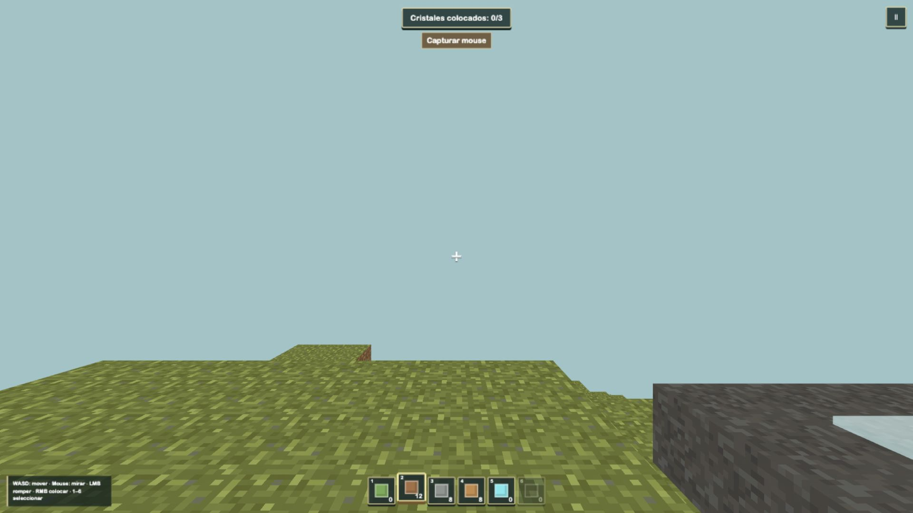

# Rabbit Voxel Lab



Template 3D de construcción por bloques para Rabbit Game Lab, construido con PlayCanvas, Vite y TypeScript estricto. Incluye vistas FPS y tercera persona, un explorador voxel visible y el objetivo de recuperar tres cristales expuestos para colocarlos en los sockets luminosos del faro.

La isla incluye un ambiente natural enteramente procedural: presets coordinados de día/noche, sol, luna y estrellas, dos capas de nubes voxel, un lago orgánico transitable, costa con juncos y piedras, partículas y audio suave de viento/agua. No requiere assets ambientales ni dependencias adicionales.

## Ejecutar

Requiere Node.js 24 o posterior.

```bash
npm ci
npm run dev
```

Gates de entrega:

```bash
npm run check
npm run build
node ~/.codex/skills/create-rabbit-playcanvas-game/scripts/audit-template.mjs .
```

## Controles

| Dispositivo | Movimiento y cámara | Acciones |
|---|---|---|
| Desktop | WASD; mover el cursor rota la cámara; Shift para sprint | Espacio salta, LMB rompe, RMB coloca, V cambia cámara, rueda/1–6 selecciona, Esc/P pausa |
| Touch | Joystick izquierdo, drag derecho | Botones de salto, romper, colocar y cámara; hotbar tocable |
| Gamepad | Stick izquierdo y derecho | A salta, Y cambia cámara, RT rompe, LT coloca, LB/RB cambia slot, Start pausa |

Sin pointer lock, mover el cursor sobre el canvas rota la cámara sin mantener ningún botón. El pointer lock queda disponible como modo opcional para giros ilimitados; LMB rompe y RMB coloca en ambos modos.

## Arquitectura

- `src/game.config.ts`: única superficie pública de tuning.
- `src/camera/`: contrato público de cámaras y avatar.
- `src/data/blocks.ts`: registro de bloques e IDs estables.
- `src/voxel/`: `Uint8Array` por chunk, generación determinista, DDA y face-culling.
- `src/environment/`: contrato tipado y reglas deterministas de lagos.
- `src/sim/`: jugador cinemático y reglas sin dependencias de PlayCanvas.
- `src/entities/`: escena, cámaras, avatares, mallas opaca/líquida por chunk, ambiente, selección y efectos.
- `src/systems/`: composición, input normalizado, HUD, audio y lifecycle Rabbit.
- `src/rabbit/`: contrato de plataforma protegido.

El mundo mide 48×32×48 y contiene 18 chunks de 16³. Se generan todos antes de `ready`; las ediciones reconstruyen como máximo dos chunks por frame y también invalidan el vecino cuando tocan un borde. El agua usa una capa transparente compartida: no tiene física de fluidos, no bloquea el DDA y se restaura de forma determinista cuando se rompe un bloque colocado dentro del lago.

## Tuning para AI

`CONFIG.camera` concentra modo inicial, selector, FOV, sensibilidad y cámara de seguimiento; `CONFIG.player.avatar` elige el explorador procedural o el GLB de Quaternius. Para arrancar en tercera persona basta cambiar `camera.initialMode` a `third-person`; la UI puede ocultarse con `camera.switching.showButton: false` sin retirar el sistema.

`CONFIG.environment` concentra los presets `day/night`, estrellas, nubes, lagos, costa, partículas y audio. El selector temporal está oculto por defecto; para arrancar de noche basta cambiar `environment.sky.initialMode` a `night`. Las recetas están en [`docs/game-config.md`](docs/game-config.md) y [`docs/environment-config.md`](docs/environment-config.md).

## Asset CC0

El terreno usa `public/assets/textures/blocks-pixel-art.png`. También se distribuye `public/assets/models/quaternius-character-male-2.glb` como backend de avatar opcional: sólo es boot-critical cuando `player.avatar.renderer` vale `gltf`. Ambos provienen del Cube World Kit CC0 de Quaternius. Consultá `THIRD_PARTY.md` para provenance.

Una extensión futura con props del pack debe seguir este flujo: seleccionar sólo el asset necesario, convertir glTF a GLB, inspeccionar clips, registrar escala/correcciones/collider y cargarlo opcionalmente después de `ready`.

## Alcance deliberado

No hay mundo infinito, streaming, greedy meshing, crafting, enemigos, natación, simulación de fluidos, iluminación voxel, backend, guardado ni multiplayer. Restart y recarga vuelven a generar la seed `1337`. Greedy meshing se evaluará únicamente si mediciones en dispositivos objetivo demuestran que el face-culling actual no alcanza.
